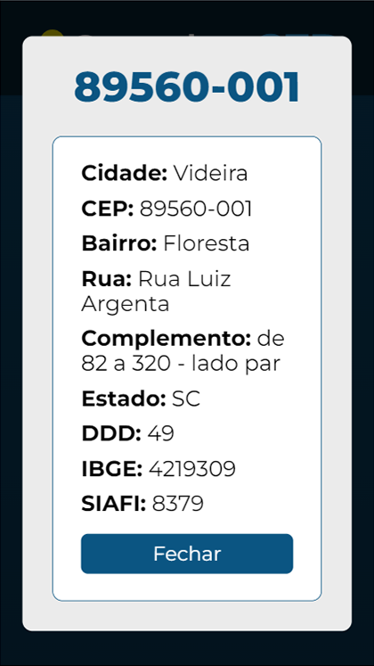
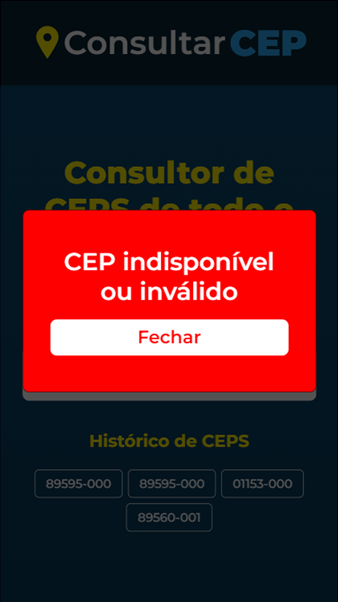
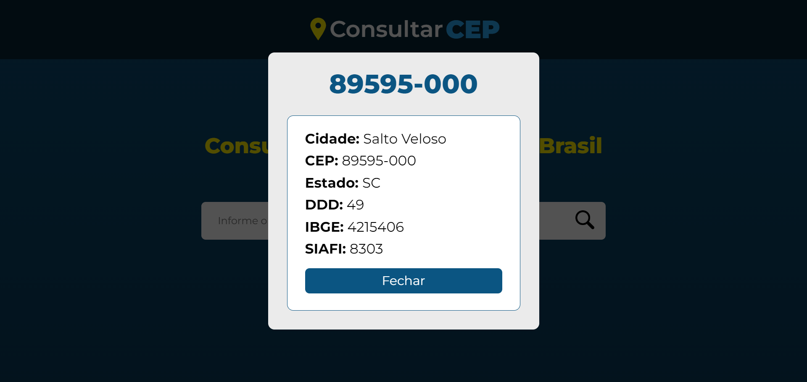
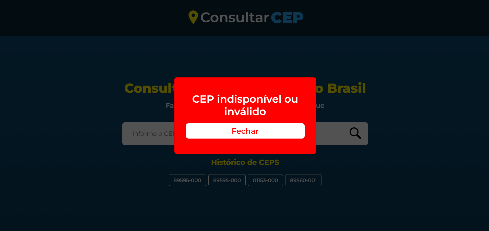

# Consultar CEP

## Sobre o projeto

O projeto em questão se trata de uma plataforma de consulta de CEP, desenvolvido com React.JS e utilizando a API ViaCep, onde é possivel receber diversas informações de um endereço através do CEP. O projeto foi desenvolvido com o objetivo de demonstrar e praticar minhas habiliades como desenvolvedor Front-End e com o React.

É possível acessar a página a partir do botão a seguir.

## Layout Mobile

## Layout Desktop

## Tecnologias utilizadas

### Front-End

## Autor

◾️ Maicon de Oliveira da Silva

